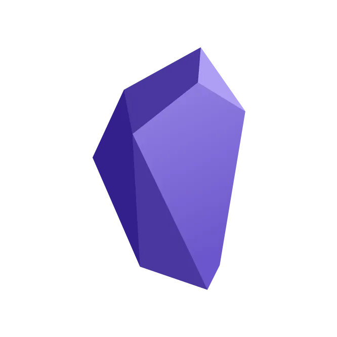

<h1 align="center">Obsidian 插件开发文档</h1>

 

本文翻译自 [这篇文档](https://marcus.se.net/obsidian-plugin-docs)，相应的 github 地址请[戳这里](https://github.com/marcusolsson/obsidian-plugin-docs)~

由于本人水平以及精力有限，如果有翻译不周到之处还望海涵，方便的话可以提 [Issue](https://github.com/luhaifeng666/obsidian-plugin-docs-zh/issues) 以便让我修正~

有愿意加入的小伙伴欢迎提PR~
