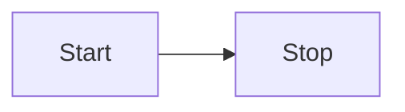

# Markdown 后处理

如果您想要改变 Markdown 文档在预览模式下的渲染方式，您可以添加自己的 _Markdown 后处理器_。见名知意，该后处理器在 Markdown 被处理成 HTML _之后_ 运行。它可以让您添加，删除，或者替换渲染后的文档中的[HTML 元素](../user-interface/html-elements.md)。

下例搜索包含在两个冒号 `:` 之间的内容，并将其替换为恰当的 emoji 表情：

::: code-group

```ts [main.ts] {6,15}
import { Plugin } from "obsidian";
import { Emoji } from "./emoji";

export default class ExamplePlugin extends Plugin {
  async onload() {
    this.registerMarkdownPostProcessor((element, context) => {
      const codeblocks = element.querySelectorAll("code");

      for (let index = 0; index < codeblocks.length; index++) {
        const codeblock = codeblocks.item(index);
        const text = codeblock.innerText.trim();
        const isEmoji = text[0] === ":" && text[text.length - 1] === ":";

        if (isEmoji) {
          context.addChild(new Emoji(codeblock, text));
        }
      }
    });
  }
}
```

:::

`Emoji` 类继承自 [`MarkdownRenderChild`](../reference/typescript/classes/MarkdownRenderChild.md), 并用带有表情符号的 `span` 元素替换代码块:

::: code-group

```ts [emoji.ts] {3,19-22}
import { MarkdownRenderChild } from "obsidian";

export class Emoji extends MarkdownRenderChild {
  static ALL_EMOJIS: Record<string, string> = {
    ":+1:": "👍",
    ":sunglasses:": "😎",
    ":smile:": "😄",
  };

  text: string;

  constructor(containerEl: HTMLElement, text: string) {
    super(containerEl);

    this.text = text;
  }

  onload() {
    const emojiEl = this.containerEl.createSpan({
      text: Emoji.ALL_EMOJIS[this.text] ?? this.text,
    });
    this.containerEl.replaceWith(emojiEl);
  }
}
```

:::

## 后处理 Markdown 代码块

您知道么，您可以通过类似以下文本创建 `mermaid` 代码块，以在在 Obsidian 中创建 [Mermaid](https://mermaid-js.github.io/) 图表？

````md

````

如果更改为预览模式，代码块中的文本变为下图：

<div align="center">


</div>

如果您想添加自己的类似以下 Mermaid 的自定义代码块，您可以使用 [`registerMarkdownCodeBlockProcessor`](../reference/typescript/classes/Plugin_2.md#registermarkdowncodeblockprocessor)。以下示例将包含 CSV 数据的代码块呈现为表格：

```ts
import { Plugin } from "obsidian";

export default class ExamplePlugin extends Plugin {
  async onload() {
    this.registerMarkdownCodeBlockProcessor("csv", (source, el, ctx) => {
      const rows = source.split("\n").filter((row) => row.length > 0);

      const table = el.createEl("table");
      const body = table.createEl("tbody");

      for (let i = 0; i < rows.length; i++) {
        const cols = rows[i].split(",");

        const row = body.createEl("tr");

        for (let j = 0; j < cols.length; j++) {
          row.createEl("td", { text: cols[j] });
        }
      }
    });
  }
}
```
